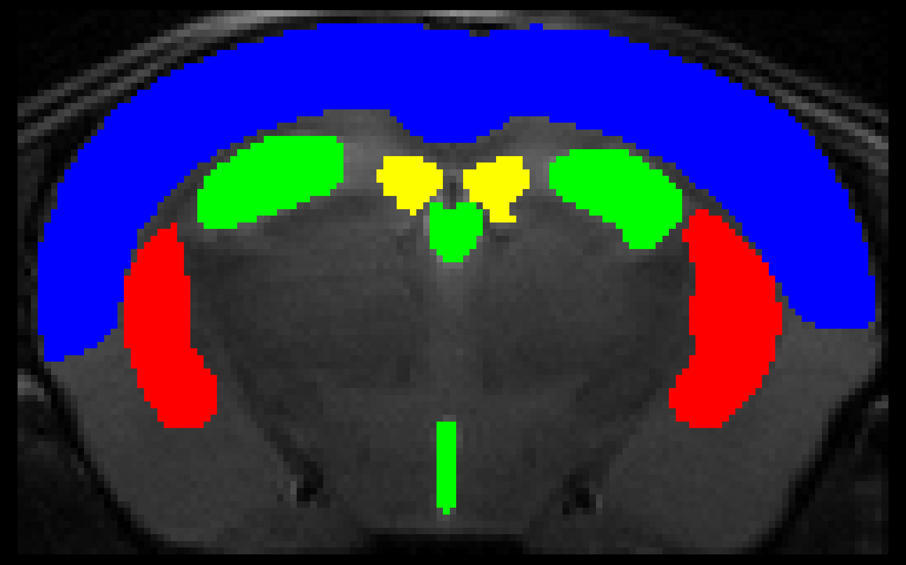

# MU-Net
Multi-task U-Net for the simultaneous segmentation and skull-stripping of mouse brain MRI

This convolutional neural network is designed to perform skull-stripping and region segmentation on mouse brain MRI. Files included:
MUNet.py: network definitions
runMU-Net.py : script to run segmentation on nifti MRI volumes
helperfile: Auxiliary functions for runMU-Net.py
weights: trained network parameters for each dataset fold
weights_N3: network parameters when trained on N3-corrected MRI volumes

Developed in PyTorch 1.0.1, the included script also requires nibabel, skimage and tqdm. 

This network is trained on coronal T2 mouse brain MRI delineated with a bounding box, and so for the network to function correctly MRI volumes need to be cropped to a bounding box around the brain. To automate this task we include a lightweight auxiliary network. You can exclude this step by using the "--boundingbox False" option.
## Installation:
It is recommended to create a virtual environment. For this guide we will assume you are using the [Anaconda](https://www.anaconda.com/) data science platform. You can download Anaconda for your system [here](https://www.anaconda.com/distribution/).

0. Creating a new environment: 

    `conda create --name MyEnv`
    
1. Activate it: 

    `conda activate MyEnv`

2. Install PyTorch. Visit https://pytorch.org/get-started/locally/ and select your OS, package manager and CUDA version. Run the suggested line in your conda environment. It should look like this: 

    `conda install pytorch torchvision cudatoolkit=10.0 -c pytorch`

3. Install other required packages: 

    `conda install tqdm numpy`

4. These packages are available from a different channel: 

    `conda install -c conda-forge scikit-image nibabel`

5. Clone this repository: 

    `git clone https://github.com/Hierakonpolis/MU-Net`
    
We're good to go.

## Usage:
python3 runMU-Net.py [options] [list of volumes]

[list of volumes] is a list of paths to nifti volumes separated by spaces

Options:

--overwrite [True/False]: Overwrite outputs if file already exists (default: False)
    
--N3 [True/False]: Load model weights for N3 corrected volumes (default False)
    
--multinet [True/False]: use networks trained on all folds and apply majority voting. (default True)

--probmap [True/False]: output unthresholded probability maps rather than the segmented volumes (default False)

--boundingbox [True/False]: automatically estimate bounding box using auxiliary network (default True)

--useGPU [True/False]: run on GPU, requires a CUDA enabled GPU and PyTorch installed with GPU support (default True)

Mask volumes are generated in the same folder as the segmented files.

Example: 

python3 runMU-Net.py --overwrite True my/favourite/mouse.nii my/other/one.nii

## Acknowledgments

R.D.F.'s work has received funding from the European Union's Horizon 2020 Framework Programme under the Marie Skłodowska Curie grant agreement No #691110 (MICROBRADAM) and J.M.V.' work was founded from Marie Skłodowska Curie grant agreement No #740264 (GENOMMED). 

The content is solely the responsibility of the authors and does not necessarily represent the official views of the European commission.

We also extend our thanks to the Academy of Finland, grants (#275453 to A.S. and #298007 to O.G.).

